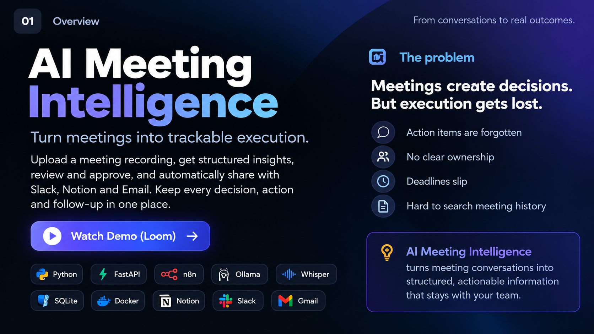
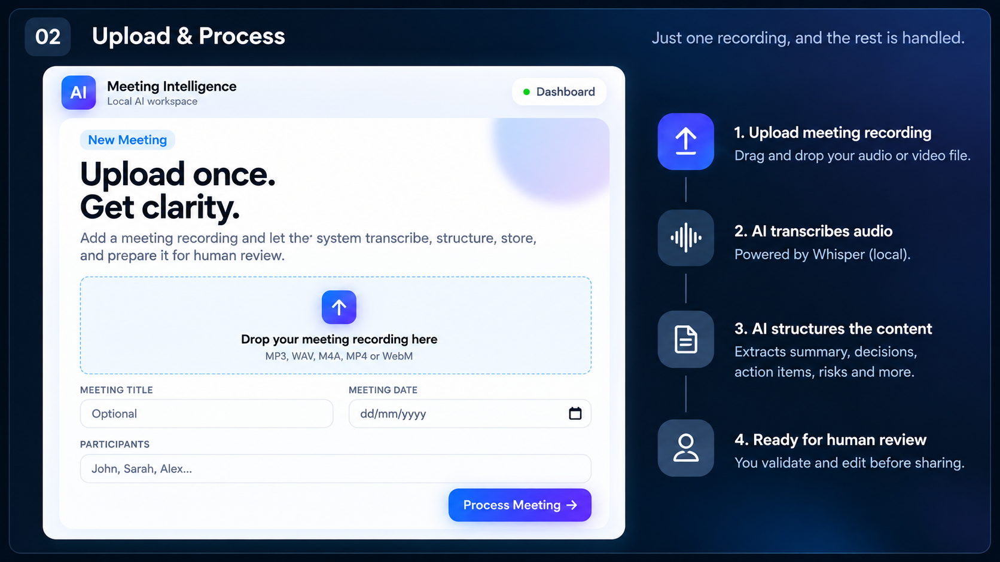
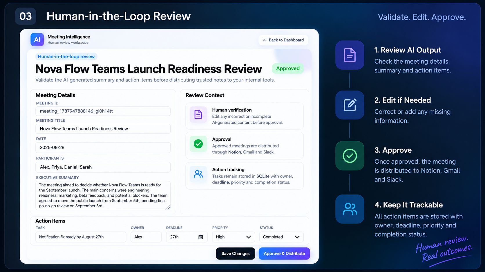
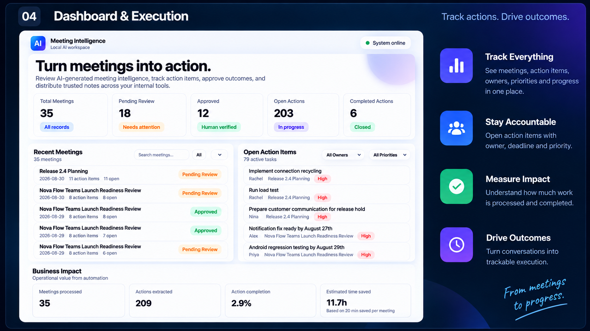

# AI Meeting Intelligence

Turn meeting conversations into structured, trackable execution.

Upload a meeting recording → extract decisions and actions → review the AI output → distribute approved information → track execution.

[Watch the Demo →](YOUR_LOOM_LINK)

---

## Overview

## Upload & Process

One recording goes in. The system transcribes and structures the conversation for human review.

## Human-in-the-Loop Review

AI-generated meeting intelligence stays editable and requires human approval before distribution.

## Dashboard & Execution

Track meetings, action items, ownership, priorities, completion and estimated time saved from one dashboard.

## Architecture & Integrations

Meeting recordings are processed locally, converted into structured intelligence, reviewed by a human, then distributed across team tools and tracked through the dashboard.

## Built With

`Python` · `FastAPI` · `n8n` · `Ollama` · `Llama 3` · `Whisper` · `SQLite` · `Docker`

---

Built as an end-to-end AI product prototype for turning meeting conversations into execution.
