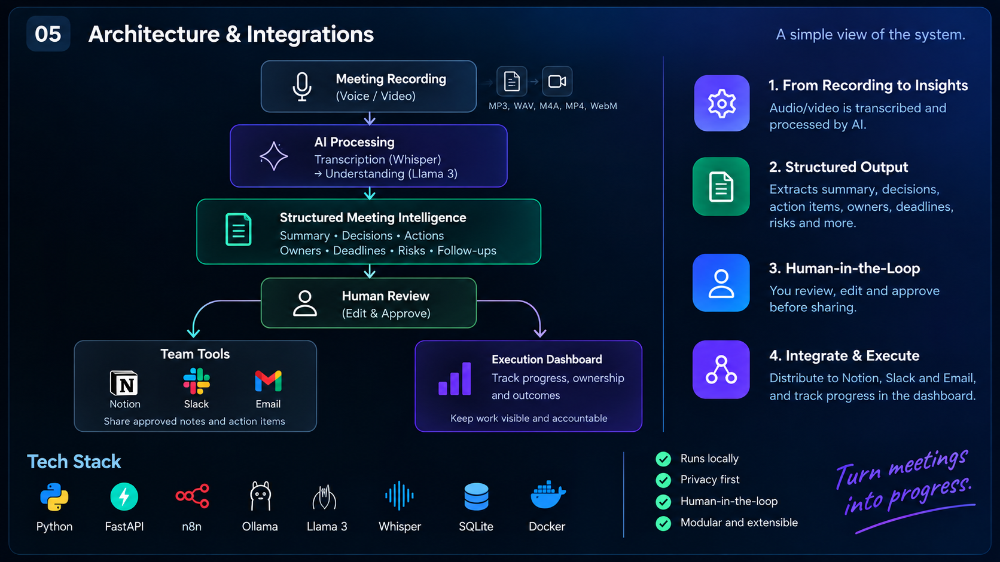

# Architecture

AI Meeting Intelligence is a local-first system that converts meeting recordings into structured, reviewable, and trackable information.

## System Flow

**Meeting Recording → AI Processing → Structured Meeting Intelligence → Human Review → Distribution & Execution**

### 1. Meeting Input

The system accepts meeting recordings in common audio and video formats.

### 2. AI Processing

The recording is transcribed locally using **Whisper** and processed using **Llama 3 through Ollama**.

The conversation is converted into structured meeting intelligence including:

- Summary
- Decisions
- Action items
- Owners
- Deadlines
- Priorities
- Risks
- Follow-ups

### 3. Human-in-the-Loop

AI-generated information is not distributed automatically.

Users can review, edit, and approve the extracted information before it enters the team's workflow.

### 4. Distribution

Once approved, meeting intelligence is distributed across:

- Notion
- Slack
- Email

### 5. Execution Dashboard

Meetings and action items remain trackable after distribution.

The dashboard provides visibility into:

- Meeting status
- Open and completed actions
- Ownership
- Priorities
- Deadlines
- Progress

## System Architecture

## Tech Stack

| Layer | Technology |
| --- | --- |
| Transcription | Whisper |
| LLM | Llama 3 |
| Local AI Runtime | Ollama |
| Automation | n8n |
| Backend | Python, FastAPI |
| Storage | SQLite |
| Infrastructure | Docker |
| Integrations | Notion, Slack, Gmail |

## Design Principles

**Local-first** — meeting processing runs locally.

**Human-controlled** — AI output is reviewed before distribution.

**Structured** — conversations become actionable data rather than static notes.

**Integrated** — approved information moves into tools teams already use.

**Trackable** — actions remain visible after the meeting ends.
